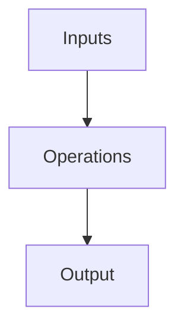

 
<!-- .slide: data-background-color='#0e2f44' style='color: white' -->
# SunCoke Energy, Inc.
_Company Overview – 2024_

        
---

 
## 🚀 Executive Summary

SunCoke Energy is a raw material processing and handling company specializing in cokemaking and logistics for steel and power customers. The company reported record safety performance and strong operational results in 2024.
        
---

## 🧱 Business Segments

_No business segment info available._
---

 
<!-- .slide: data-layout='2x' -->
## 📊 Financials vs. Risks

### Financials
- Revenue: Not specified
- EBITDA: Not specified
- Valuation: N/A

### Risks
_No risks provided._
        
---

 
## 🌱 ESG & Sustainability

_No ESG data available._
        
---

 
## 🧑‍💼 Leadership Snapshot

**Not provided, CEO**  
_Not provided_
        
---

## 💬 Strategic Insights

> "2024 was another strong year for SunCoke, with our domestic coke fleet continuing to run at full capacity throughout the year."

---

 
## 🛋️ Operational Flow

        
---

## 🗞️ Recent News

- Reported record safety performance and strong operational results in 2024.
- First quarter 2024 net income was $21.1 million, showing growth compared to the previous year.

---

 
## 🙏 Thank You

Thanks for your interest!

📧 N/A  
📞 N/A
        