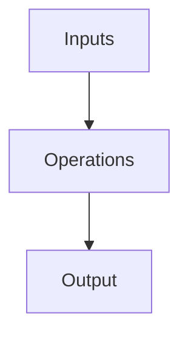

<!-- .slide: data-background-color='#0e2f44' style='color: white' -->
# Teine Energy Ltd.
_Company Overview – 2024_

        
---

## 🚀 Executive Summary

Teine Energy, in partnership with Canadian Pension Plan Investments, aims to maximize investment returns while providing environmentally and ethically sourced energy to the world.
        
---

## 🧱 Business Segments

---

<!-- .slide: data-layout='2x' -->
## 📊 Financials vs. Risks

### Financials
- Revenue: N/A
- EBITDA: Not specified
- Valuation: N/A

### Risks

        
---

## 🌱 ESG & Sustainability

        
---

## 🧑‍💼 Leadership Snapshot

**Not specified, CEO**  
_N/A_        
        
---

## 💬 Strategic Insights

---

## 🛋️ Operational Flow

        
---

## 🗞️ Recent News

---

## 🙏 Thank You

Thanks for your interest!

📧 N/A  
📞 N/A
        