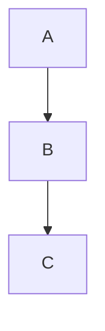

<!-- .slide: data-background-color='#ffffff' style='height: 100vh; display: flex; flex-direction: column; justify-content: flex-start; align-items: center;' -->

  <h1 style="font-size: 84px; letter-spacing: 2px; color: #0e2f44; margin-bottom: 20px;">
    <strong>TEINE ENERGY~</strong>
  </h1>
  

    Company Overview – 2025
  

        
---

<!-- .slide: data-background-color="#ffffff" style="text-align: center;" -->
<h2 style="color: #0e2f44; font-size: 48px; margin-bottom: 40px; text-align: center;">Executive Summary</h2>

  

    
  

  

    

      

        
$ <strong>N/A</strong>

        
Total Sales

      

      

        
F <strong>N/A</strong>

        
Cokemaking Facilities

      

      

        
E <strong>$261,700,000</strong>

        
Adj. EBITDA

      

      

        
L <strong>N/A</strong>

        
Tons handled

      

      

        
P <strong>N/A</strong>

        
Tons produced

      

    

    <ul style="line-height: 1.8;">
      <li><strong>Integrated operations:</strong> Includes both cokemaking and coal logistics terminals.</li><li><strong>Global reach:</strong> Serving steel manufacturers in the US and Brazil.</li><li><strong>Strategic contracts:</strong> Long-term, take-or-pay agreements ensure stability.</li>
    </ul>

    

      Company Overview – 2025
    

  

---

## Business Segments

- Segment information not available
---

## Financials vs. Risks

**Financial Highlights:**
- Revenue: N/A
- EBITDA: $261,700,000

**Key Risks:**
- Market volatility
- Regulatory changes

---

## Market Trends

---

## Leadership Snapshot

- CEO: N/A
- Background: N/A
---

## Strategic Insights

- Placeholder quote
---

## Operational Flow

---

## Recent News

- Placeholder news item
---

## Thank You

Email: N/A
Phone: N/A
